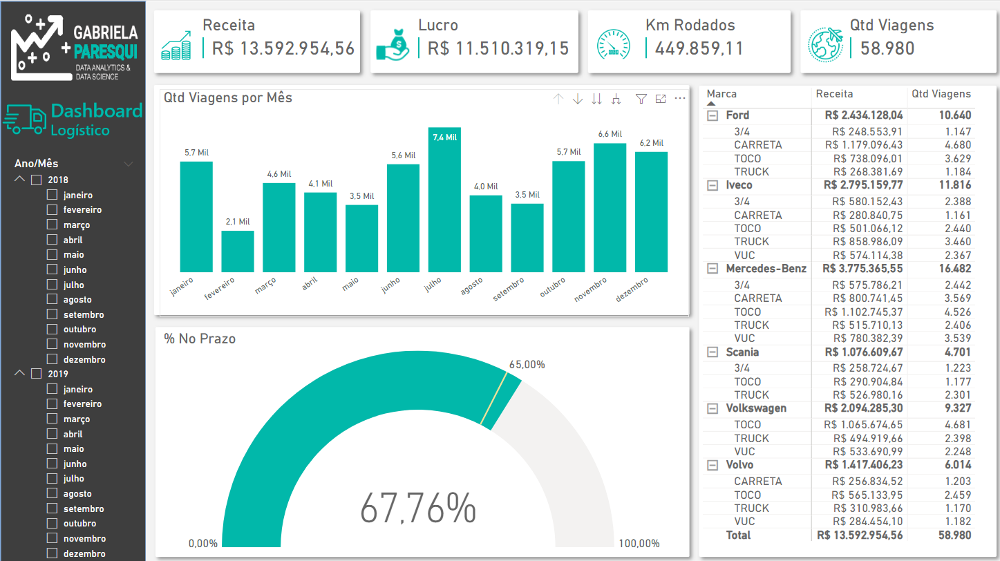

# Dashboard Logístico

## Contexto
Neste projeto, desenvolvi um dashboard logístico utilizando a ferramenta Microsoft Power BI. A ideia principal deste projeto foi apresentar informações referentes a entregas de produtos (Fretes) realizados por uma empresa de transportes. Os dados foram extraidos a partir do arquivo Base Logistica.xlsx, e  a análise foi feita com dados  que compreendem um período que vai de 2018 a 2020. A imagem abaixo exibe os resultados da análise.

